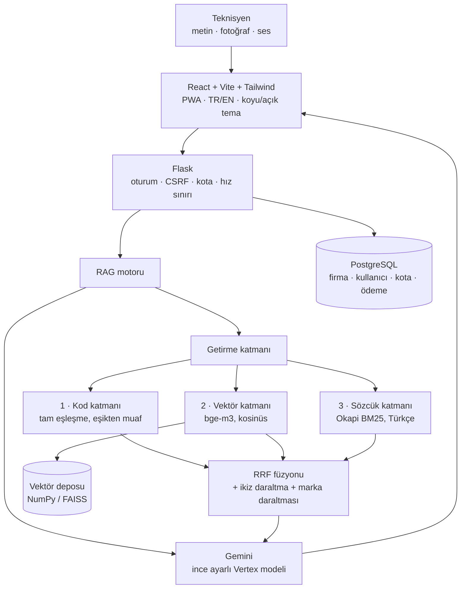

<h1 align="center">Clévo AI</h1>

  <strong>Türkiye'nin HVAC teknik servis bilgi tabanı.</strong> 
  Sahadaki teknisyen arızayı metin, fotoğraf veya sesle sorar — sistem ilgili 
  servis kaydını getirir ve çözümü usta diliyle yazar.

  <a href="https://xn--clvo-cpa.com"><strong>clévo.com →</strong></a>

  
  
  
  
  
  

> Bu depo bir **vitrindir**: ürünün ne olduğunu, nasıl kurulduğunu ve hangi
> mühendislik kararlarının ölçümle verildiğini anlatır. Kaynak kodu ve arıza kodu
> korpusu tescillidir, özel bir depoda durur.

---

## Problem

Bir kombi `E04` gösterdiğinde cevap, markanın servis kılavuzunun 140. sayfasındaki bir
tabloda durur. Türkiye'de 27 marka, dört cihaz tipi ve her markanın kendi kod şeması
var — aynı `E04` Baymak'ta başka, Vaillant'ta başka bir arızadır. Teknisyen sahada,
cihazın önünde, telefonla çalışıyor.

Yaygın çözüm bir "hata kodu botu"dur: koda karşılık bir cümle. Yetmiyor, çünkü
teknisyenin sorusu çoğu zaman kod değil: *"kombi çalışıyor ama radyatörler ısınmıyor,
manometre 0.5 bar"*. Clévo AI bir arama botu değil, **servis bilgi tabanıdır**.

## Ne yapar

| Girdi | Örnek |
|-------|-------|
| **Metin** | `Vaillant F.75 veriyor, pompa çalışıyor` |
| **Fotoğraf** | Kombi ekranının fotoğrafı — kodu okur, tanıyı yazar |
| **Ses** | Teknisyen eldivenliyken sesle sorar, deşifre edilir |

Cevap, dayandığı **kayıtları** (marka / cihaz / kod / model) rozet olarak yanında
taşır — teknisyen hangi belgeye güvenildiğini görür. Arama kapsamı sohbetin içinden
marka seçilerek daraltılır.

---

## Mimari

Embedding, vektör deposu, LLM, yeniden sıralayıcı, sözcük araması, e-posta ve ödeme
katmanlarının **hepsi** soyutlama (`base.py` + `factory.py`) üzerinden çalışır: yeni
sağlayıcı fabrikaya kaydedilir, geri kalan kod değişmez.

---

## Neden hibrit arama

Üç katmanın her biri, diğer ikisinin **ölçülmüş** bir körlüğünü kapatıyor.

**1 · Kod katmanı.** Dense embedding'ler `E01` ile `E28`i ayırt edemez — ikisi de
"harf+rakam biçiminde bir kod". Kod sorgularında saf vektör aramasının başarısı:

|  | recall@8 |
|---|---|
| Saf vektör araması | **0.188** |
| Kod katmanı eklenince | **1.000** |

**2 · Vektör katmanı.** Teknisyen kodu değil belirtiyi anlatınca ("radyatörler
ısınmıyor") sözcük eşleşmesi tutmaz, anlam araması tutar.

**3 · Sözcük katmanı (BM25).** Dense vektör cümlenin tamamını ortalar; uzun saha
anlatımında tek gerçek sinyal gürültüde boğulur. BM25'te nadir terim ("bar",
"manometre") en yüksek ağırlığı alır:

|  | recall@1 | MRR |
|---|---|---|
| Kod + vektör | 0.782 | 0.853 |
| **+ BM25 (RRF füzyonu)** | **0.873** | **0.920** |

İki sıralama ağırlıklı toplamla değil **RRF** ile birleştirilir. Aynı arızayı anlatan
farklı kodlu kayıtlar ("ikizler") listede tek yer tutar; elenen kodlar temsilciye
iliştirilip bağlama girer.

### Açılmayan özellik: cross-encoder yeniden sıralama

Yazıldı, ölçüldü, **kapalı bırakıldı** — ve bu bir eksiklik değil, bir karar:

|  | zor sorgularda recall@1 | gecikme |
|---|---|---|
| Kapalı (varsayılan) | 0.636 | ~60 ms |
| Açık | **0.818** · hiçbir sorgu bozulmadan | **~7 sn/sorgu** (CPU) |

Kalite kazancı gerçek, bedeli de gerçek. Özellik, kullanıcının bilerek açtığı
"derin arama" kipinin arkasında durur — varsayılan olarak her teknisyene 7 saniye
ödetmez.

---

## Ölçüm disiplini

Bu projede **bir sayı yoksa karar da yoktur.**

- **349 altın sorgu** + 15 alan dışı tuzak sorgusu. Alan dışı sorgu ("araba motoru
  ısınıyor") *reddedilmek* zorundadır — bir RAG sisteminin en kolay yalanı, bilmediği
  şeye de cevap vermesidir.
- Benzerlik eşiği **modelden modele taşınmaz**: kosinüs mutlak bir ölçek değildir,
  model değişince eşik yeniden taranır.
- Marka daraltmasında **tolerans sıfırdır**. Yanlış marka, canlı gazlı bir cihazda
  yanlış onarımdır: Vaillant'ın çözümü Demirdöküm'e yazılmaz — kodlar ve anlamlar
  birebir aynı olsa bile.
- Bir ıskanın sebebine **elle etiket konmaz**; ayrı bir teşhis aracı sorgunun nadir
  terimlerinin hedef kayıtta geçip geçmediğini ölçer ve "kelime uyuşmazlığı" ile
  "sıralama rekabeti"ni ayırır. Bu araç, iki elle etiket arka arkaya yanlış çıktığı
  için yazıldı.

### Otomatik kapılar

Kapılar insan dikkatine değil çıkış koduna bağlıdır — başarısızlıkta 1 döner.

| Kapı | Ölçtüğü |
|------|---------|
| Getirme kalitesi | recall@k, MRR, eşik taraması, marka daraltması |
| Kimlik akışları | **90 sınama** — kayıt, doğrulama, davet, rol, sıfırlama, kaba kuvvet |
| Oturum kesiti | **25 sınama** — kiracı sınırı: B, A'nın konuşmasını okuyabiliyor / yazabiliyor mu |
| Marka daraltması | **12 sınama** — HTTP seviyesinde arama kapsamı |
| Kota | **51 sınama** — ağırlıklı sayaç, iade, dönem penceresi |
| Ödeme | **47 sınama** — idempotency, webhook tekrarı, iptal |
| Yönetici paneli | **58 sınama** — dokuz ucun tamamı + hız sınırı |
| WCAG kontrast | her iki temada metin ≥ 4.5:1, kontrol sınırı ≥ 3:1 |
| Düzen | 4 sayfa × 10 genişlik × 2 giriş kipi: yatay taşma + dokunma hedefi |
| Dağıtım ortamı | kodu değil **ortamı**: sessizce yanlış davranacak her ayar |

Son kapı, projenin en pahalı hata sınıfını hedefler: **sunucuyu düşürmeyen hatalar.**
Ödeme sağlayıcısı yapılandırılmamışsa abonelik açılır ve para çekilmez; e-posta
sağlayıcısı unutulmuşsa doğrulama bağlantısı günlüğe basılır ve kimse hesabını
açamaz. İkisi de "çalışıyor" görünür. O yüzden ölçülüyorlar.

---

## Ürün tarafı

Çok kiracılı bir SaaS olarak çalışır:

- **Kimlik:** e-posta + parola, sunucudaki oturum satırı + imzalı HttpOnly çerez.
  JWT değil — iptal edilebilirlik para işidir. Kiracı numarası istemciden hiç gelmez.
- **Roller:** firma yöneticisi ve teknisyen. Kota göstergesi, kullanım dökümü ve
  ödeme geçmişi yalnız yöneticide — teknisyen kalan sayıya bakıp bir şey yapamaz,
  dolduğunu zaten yanıttan öğrenir.
- **Kota:** dekoratör zinciri, atomik rezervasyon, hata hâlinde iade. Sayaç *kapı*,
  ölçüm *kanıttır*; ayrışırlarsa kanıt doğrudur ve haftalık bir mutabakat raporu
  ayrışmayı söyler.
- **Kota sayıları tahminle değil ölçümle:** her çağrının gerçek token'ı saklanır.
  **Token saklanır, para saklanmaz** — fiyat ve kur değişir, token değişmez.
- **Ödeme:** sonuç sağlayıcıya *sorulur*, dönüş gövdesine güvenilmez; idempotency
  kodda değil veritabanı kısıtındadır. Kart verisi sunucuya hiç uğramaz.
- **Hız sınırı:** giriş, kayıt, jeton ve sorgu uçlarında ayrı eksenler. Kota dönemin
  toplam faturasını korur, hız sınırı dakikadaki patlamayı — biri diğerinin yerine
  geçmez.

### Saha koşulları geri alınmaz

Kullanıcı dizlerinin üstünde, eldivenli, güneş altında ve tek elle çalışıyor:
yakınlaştırma kapatılmaz, dokunma hedefi ≥ 44 px (**iki eksende de**), yükseklik
`100dvh`, `prefers-reduced-motion` altında animasyon durur ve **renk tek gösterge
değildir**. Metin asla ham HTML olarak basılmaz — `dangerouslySetInnerHTML` bu
projede hiç kullanılmadı.

Alan adı aksanlı (`clévo.com`) ve `é` Türk klavyesinde yok. Panzehir, adresi
yazdırmamak: ana ekrana eklenebilen bir PWA ve baskı için QR üreteci.

---

## Teknoloji

| Katman | Seçim |
|--------|-------|
| Arayüz | React · Vite · Tailwind v4 · PWA |
| Sunucu | Python · Flask |
| Embedding | `BAAI/bge-m3` (1024 boyut) |
| Vektör deposu | NumPy (kalıcı) · FAISS (opsiyonel) |
| Sözcük araması | Okapi BM25, Türkçe belirteçleme (saf Python) |
| Yeniden sıralama | cross-encoder (isteğe bağlı) |
| LLM | Gemini — ince ayarlı Vertex modeli |
| Veritabanı | PostgreSQL · çift arka uçlu veri katmanı |
| Dağıtım | tek Linux sunucu · systemd · Caddy (otomatik TLS) |

### Dağıtım: bir ölçüm, standart tavsiyeyi tersine çevirdi

Yaygın tavsiye "dev sunucusunu bırak, `gunicorn -w 4` kullan"dır. Bu projede ölçüldü
ve **belleği dörde katlıyor:**

|  | bellek |
|---|---|
| Tek süreç, zirve | ~3,5 GB (bge-m3 ~1,7 GB + yeniden sıralayıcı ~1,6 GB) |
| **+ 4 eşzamanlı iplik** | **+0 MB** — model paylaşılır |
| Aynı eşzamanlılık, 4 ayrı süreç | ~14 GB |

Doğrusu `--workers=1 --threads=8`. İş zaten LLM'i beklemekle geçiyor (2-5 sn ağ,
~60 ms getirme), yani iplik doğru eşzamanlılık modeli. Aynı ölçüm serverless'ı da
eledi: `torch` tek başına 496 MB, platform sınırı 250 MB.

---

## Kaynak kodu

Kaynak kodu ve arıza kodu korpusu **tescillidir** ve özel bir depoda durur.
Teknik ayrıntı, mimari ya da iş birliği için: [clévo.com](https://xn--clvo-cpa.com)

© 2026 Talha Kaynak · Tüm hakları saklıdır

